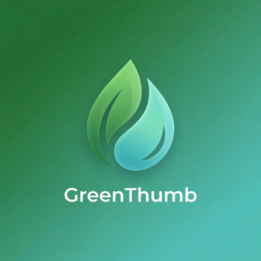
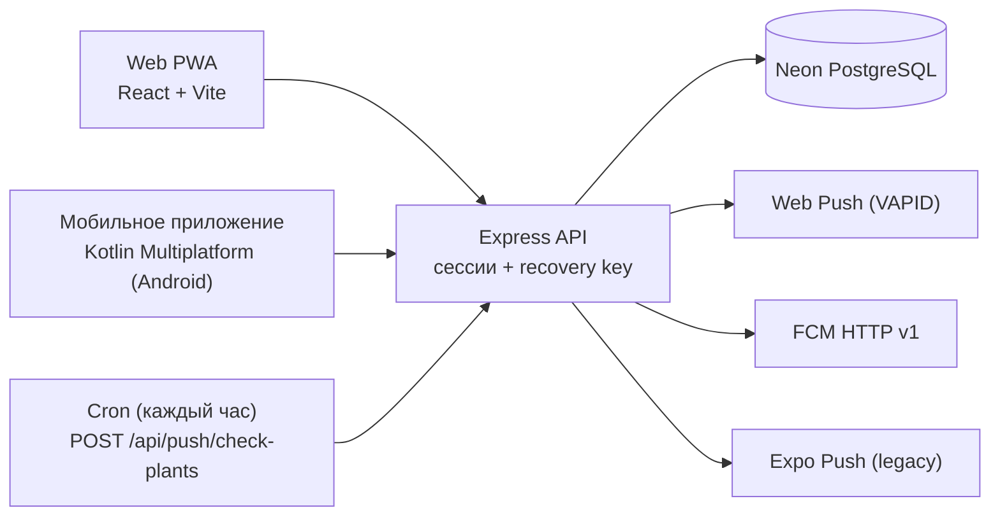

<p align="center">
  
</p>

<h1 align="center">GreenThumb</h1>

<p align="center">
  PWA и API для отслеживания полива и ухода за комнатными растениями
</p>

<p align="center">
  <a href="https://greenthumb.xmpp.site">greenthumb.xmpp.site</a>
</p>

<p align="center">
  
  
  
  
  
</p>

---

## Что это?

GreenThumb помогает не забывать поливать цветы и ухаживать за ними: добавляете растение, указываете интервалы полива, удобрения, пересадки и обрезки — приложение напомнит, когда пора.

Проект состоит из двух частей:

- **Web PWA** (React + Vite) — устанавливается на телефон прямо из браузера, работает офлайн, присылает push-уведомления;
- **API** (Express) — бэкенд для PWA и для мобильного приложения на Kotlin Multiplatform.

## Возможности

- **Трекер полива** — визуальные статусы (просрочено / сегодня / через N дней), сортировка по срочности
- **Расширенный уход** — удобрение, пересадка, обрезка с настраиваемыми интервалами
- **Push-напоминания** — Web Push, FCM (мобильное приложение), Expo Push (legacy); время напоминания — на выбор пользователя
- **Фото растений** — загрузка с автосжатием до ~800×800
- **Анонимная авторизация** — без email и пароля, вход по recovery key (UUID), который генерируется при создании аккаунта
- **Удаление аккаунта** — прямо в приложении, с каскадным удалением данных
- **PWA** — установка как приложение на Android/iOS/Desktop
- **Русский и английский** — автоопределение языка, тёплая тёмная тема с синхронизацией системных настроек

## Архитектура



- **Сессии** — `express-session` + таблица `session` (connect-pg-simple), cookie `httpOnly`, продление при активности (rolling, 30 дней)
- **Схема БД** — Drizzle ORM, `shared/schema.ts` (общий для клиента и сервера): `users`, `plants`, `push_subscriptions`, `expo_push_subscriptions`, `fcm_push_subscriptions`
- **Фото** хранятся в `photo_url` как base64 data URL. *Известный долг: перенос в object storage (R2/S3) — base64 в строке БД раздувает и таблицу, и трафик.*

## API

Все пути — под префиксом `/api`; неизвестные пути отвечают `404`. Авторизация по сессии — cookie, получаемой при входе по recovery key.

| Метод | Путь | Назначение | Авторизация |
|-------|------|------------|-------------|
| POST | `/api/auth/create-anonymous` | Создать анонимный аккаунт, вернуть recovery key | нет |
| POST | `/api/auth/login-recovery` | Вход по recovery key | нет |
| GET | `/api/auth/me` | Текущий пользователь | сессия |
| POST | `/api/auth/logout` | Завершить сессию | сессия |
| POST | `/api/auth/regenerate-recovery-key` | Сгенерировать новый recovery key | сессия |
| PATCH | `/api/auth/update-notification-time` | Время напоминаний (только целый час, минуты нормализуются в `:00`) | сессия |
| PATCH | `/api/auth/update-timezone` | IANA-таймзона пользователя для расчёта времени напоминаний | сессия |
| DELETE | `/api/auth/account` | Удаление аккаунта каскадом: растения, все push-подписки, пользователь; сессия уничтожается | сессия |
| GET | `/api/plants` | Список растений пользователя | сессия |
| POST | `/api/plants` | Добавить растение (фото — base64 data URL в `photo_url`) | сессия |
| PATCH | `/api/plants/:id` | Изменить растение | сессия |
| DELETE | `/api/plants/:id` | Удалить растение | сессия |
| POST | `/api/plants/water-all` | Полить все растения, которым пора | сессия |
| POST | `/api/plants/postpone-all` | Отложить полив (дата последнего полива → вчера) | сессия |
| GET | `/api/push/vapid-public-key` | Публичный VAPID ключ для подписки Web Push | нет |
| POST | `/api/push/subscribe` | Подписка на Web Push | сессия |
| DELETE | `/api/push/subscribe` | Отписка от Web Push | сессия |
| GET | `/api/push/subscription` | Статус Web Push подписки | сессия |
| POST | `/api/push/subscribe-expo` | Подписка на Expo Push (legacy React Native клиент) | сессия |
| DELETE | `/api/push/subscribe-expo` | Отписка от Expo Push | сессия |
| GET | `/api/push/expo-subscription` | Статус Expo Push подписки | сессия |
| POST | `/api/push/subscribe-fcm` | Подписка на FCM (KMP-приложение, токен FCM) | сессия |
| DELETE | `/api/push/subscribe-fcm` | Отписка от FCM | сессия |
| GET | `/api/push/fcm-subscription` | Статус FCM подписки | сессия |
| POST | `/api/push/test` | Тестовое Web Push уведомление текущему пользователю | сессия |
| POST | `/api/push/check-plants` | Cron-проверка: кому нужно уход — разослать напоминания | `X-API-Key` или сессия |

## Переменные окружения

Шаблон — [.env.example](.env.example). Значения — секреты, в репозиторий не попадают.

| Переменная | Назначение |
|-----------|-----------|
| `DATABASE_URL` | Строка подключения к PostgreSQL (Neon) |
| `SESSION_SECRET` | Подпись сессионных cookie |
| `PUSH_CHECK_API_KEY` | Ключ для вызова cron-эндпоинта `/api/push/check-plants` |
| `VAPID_PUBLIC_KEY` | Публичный VAPID ключ (Web Push) |
| `VAPID_PRIVATE_KEY` | Приватный VAPID ключ (Web Push) |
| `FIREBASE_SERVICE_ACCOUNT_JSON` | Service account JSON одной строкой для FCM HTTP v1; без него ветка FCM в cron отключается |
| `PORT` | Порт сервера (по умолчанию 5000) |
| `NODE_ENV` | Режим работы (`development` / `production`) |
| `VITE_VAPID_PUBLIC_KEY` | Упомянут в `.env.example`, но текущий клиент этот ключ не читает — он запрашивает `/api/push/vapid-public-key` |

VAPID ключи генерируются один раз:
```bash
npx web-push generate-vapid-keys
```

## Локальный запуск

```bash
git clone https://github.com/vivogf/GreenThumb.git
cd GreenThumb
npm install
cp .env.example .env   # заполнить значения (минимум DATABASE_URL, SESSION_SECRET, VAPID-пара)
npm run dev            # дев-сервер (API + Vite с HMR)
```

| Скрипт | Что делает |
|--------|-----------|
| `npm run dev` | Запуск в development (`tsx server/index-dev.ts`) |
| `npm run build` | Сборка клиента (Vite) и серверного бандла (esbuild → `dist/index.js`) |
| `npm run start` | Запуск собранного приложения (`node dist/index.js`) |
| `npm run check` | Проверка типов (`tsc`) |
| `npm run db:push` | Синхронизация схемы Drizzle с БД — **с осторожностью, см. ниже** |

## Деплой

Универсальная последовательность (без привязки к конкретному хостингу):

```bash
npm run check
npm run build
# если менялась схема БД — применить миграцию (см. ниже)
pm2 restart greenthumb     # конфиг: ecosystem.config.cjs (читает .env и передаёт в процесс)
```

**Миграции БД — вручную.** `npm run db:push` (drizzle-kit push) опасен: таблица `session` (connect-pg-simple) не описана в `shared/schema.ts`, и drizzle-kit может предложить её удалить. Новые таблицы и колонки создаются идемпотентными SQL-скриптами/скриптами на `postgres` (`scripts/`), которые запускаются перед рестартом и безопасно перезапускаются.

## Уведомления

Cron раз в час вызывает `POST /api/push/check-plants` с заголовком `X-API-Key` и рассылает напоминания тем, кому пора ухаживать за растениями (полив, удобрение, пересадка, обрезка).

- **Время напоминания** — только целые часы; пользователь задаёт час, сервер нормализует минуты в `:00`
- **Семантика** — напоминание приходит в начале первого часа, который ≥ выбранного времени, в таймзоне пользователя (`users.timezone`; без неё — Europe/Moscow). Например, `09:00` → push в 09:00, `09:30` → push в 10:00
- **Дедупликация** — колонка `users.last_notified_date` (дата в локальной таймзоне пользователя): повторный тик в тот же день не шлёт второе уведомление
- **Каналы доставки**: Web Push (VAPID) для PWA, FCM HTTP v1 для KMP-приложения, Expo Push для legacy React Native клиента
- **Экономия трафика БД** — cron читает растения «тонким» запросом без `photo_url` (фото лежат в строке как base64)

## Связанные репозитории

- **Мобильное приложение (Kotlin Multiplatform, Android):** [github.com/vivogf/greenthumb-mobile](https://github.com/vivogf/greenthumb-mobile)

## Конфиденциальность

Политика конфиденциальности: [vivogf.github.io/greenthumb-mobile/privacy.html](https://vivogf.github.io/greenthumb-mobile/privacy.html)

## Дизайн

Дизайн-система (Zen Minimalist, типографика, цвета, компоненты) — в [docs/design-guidelines.md](docs/design-guidelines.md).

## Лицензия

MIT
