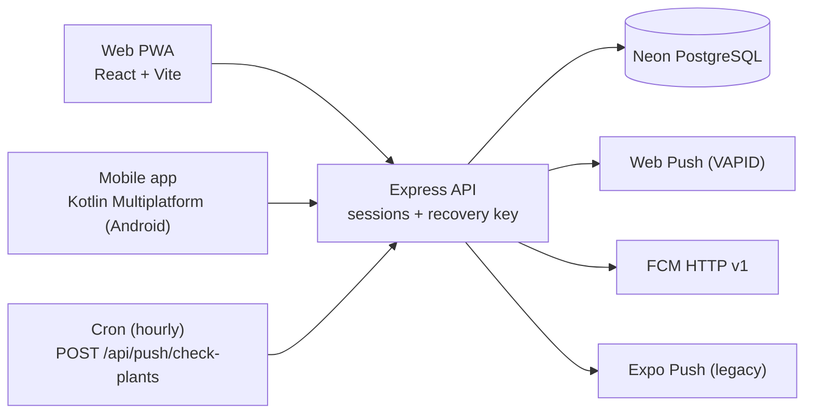

<p align="center">
  
</p>

<h1 align="center">GreenThumb</h1>

<p align="center">
  A PWA and API for tracking watering and care of houseplants
</p>

<p align="center">
  <a href="https://greenthumb.xmpp.site">greenthumb.xmpp.site</a>
</p>

<p align="center">
  
  
  
  
  
</p>

---

## What is GreenThumb?

GreenThumb helps you remember to water your flowers and take care of them: add a plant, set watering, fertilizing, repotting and pruning intervals — and the app will remind you when it is time.

The project consists of two parts:

- **Web PWA** (React + Vite) — installs onto a phone straight from the browser, works offline, sends push notifications;
- **API** (Express) — the backend for the PWA and for the Kotlin Multiplatform mobile app.

## Features

- **Watering tracker** — visual statuses (overdue / due today / in N days), sorted by urgency
- **Advanced care** — fertilizing, repotting and pruning with configurable intervals
- **Push reminders** — Web Push, FCM (mobile app), Expo Push (legacy); the reminder time is chosen by the user
- **Plant photos** — upload with auto-compression to ~800×800
- **Anonymous auth** — no email or password; sign in with a recovery key (UUID) generated when the account is created
- **Account deletion** — right in the app, with cascading data removal
- **PWA** — installable as an app on Android/iOS/Desktop
- **Russian and English** — automatic language detection, warm dark theme synced with system settings

## Architecture



- **Sessions** — `express-session` + the `session` table (connect-pg-simple), `httpOnly` cookie, extended on activity (rolling, 30 days)
- **DB schema** — Drizzle ORM, `shared/schema.ts` (shared by client and server): `users`, `plants`, `push_subscriptions`, `expo_push_subscriptions`, `fcm_push_subscriptions`
- **Photos** are stored in `photo_url` as base64 data URLs. *Known debt: move them to object storage (R2/S3) — base64 in a DB row bloats both the table and the traffic.*

## API

All routes live under the `/api` prefix; unknown routes return `404`. Authentication is session-based via the cookie issued when signing in with a recovery key.

| Method | Path | Purpose | Auth |
|-------|------|------------|-------------|
| POST | `/api/auth/create-anonymous` | Create an anonymous account, return a recovery key | none |
| POST | `/api/auth/login-recovery` | Sign in with a recovery key | none |
| GET | `/api/auth/me` | Current user | session |
| POST | `/api/auth/logout` | End the session | session |
| POST | `/api/auth/regenerate-recovery-key` | Generate a new recovery key | session |
| PATCH | `/api/auth/update-notification-time` | Reminder time (whole hours only; minutes are normalized to `:00`) | session |
| PATCH | `/api/auth/update-timezone` | User's IANA timezone for reminder time calculation | session |
| DELETE | `/api/auth/account` | Delete the account with cascading removal: plants, all push subscriptions, the user; the session is destroyed | session |
| GET | `/api/plants` | List the user's plants | session |
| POST | `/api/plants` | Add a plant (photo is a base64 data URL in `photo_url`) | session |
| PATCH | `/api/plants/:id` | Edit a plant | session |
| DELETE | `/api/plants/:id` | Delete a plant | session |
| POST | `/api/plants/water-all` | Water all plants that are due | session |
| POST | `/api/plants/postpone-all` | Postpone watering (last-watered date → yesterday) | session |
| GET | `/api/push/vapid-public-key` | Public VAPID key for Web Push subscription | none |
| POST | `/api/push/subscribe` | Subscribe to Web Push | session |
| DELETE | `/api/push/subscribe` | Unsubscribe from Web Push | session |
| GET | `/api/push/subscription` | Web Push subscription status | session |
| POST | `/api/push/subscribe-expo` | Subscribe to Expo Push (legacy React Native client) | session |
| DELETE | `/api/push/subscribe-expo` | Unsubscribe from Expo Push | session |
| GET | `/api/push/expo-subscription` | Expo Push subscription status | session |
| POST | `/api/push/subscribe-fcm` | Subscribe to FCM (KMP app, FCM token) | session |
| DELETE | `/api/push/subscribe-fcm` | Unsubscribe from FCM | session |
| GET | `/api/push/fcm-subscription` | FCM subscription status | session |
| POST | `/api/push/test` | Send a test Web Push notification to the current user | session |
| POST | `/api/push/check-plants` | Cron check: who needs care — send out reminders | `X-API-Key` or session |

## Environment variables

Template — [.env.example](.env.example). The values are secrets and never go into the repository.

| Variable | Purpose |
|-----------|-----------|
| `DATABASE_URL` | PostgreSQL (Neon) connection string |
| `SESSION_SECRET` | Signs session cookies |
| `PUSH_CHECK_API_KEY` | Key for calling the cron endpoint `/api/push/check-plants` |
| `VAPID_PUBLIC_KEY` | Public VAPID key (Web Push) |
| `VAPID_PRIVATE_KEY` | Private VAPID key (Web Push) |
| `FIREBASE_SERVICE_ACCOUNT_JSON` | Service account JSON as a single line for FCM HTTP v1; without it the FCM branch of the cron is disabled |
| `PORT` | Server port (default 5000) |
| `NODE_ENV` | Runtime mode (`development` / `production`) |
| `VITE_VAPID_PUBLIC_KEY` | Mentioned in `.env.example`, but the current client does not read it — it requests `/api/push/vapid-public-key` |

VAPID keys are generated once:
```bash
npx web-push generate-vapid-keys
```

## Local development

```bash
git clone https://github.com/vivogf/GreenThumb.git
cd GreenThumb
npm install
cp .env.example .env   # fill in the values (at minimum DATABASE_URL, SESSION_SECRET, the VAPID pair)
npm run dev            # dev server (API + Vite with HMR)
```

| Script | What it does |
|--------|-----------|
| `npm run dev` | Start in development (`tsx server/index-dev.ts`) |
| `npm run build` | Build the client (Vite) and the server bundle (esbuild → `dist/index.js`) |
| `npm run start` | Run the built app (`node dist/index.js`) |
| `npm run check` | Type check (`tsc`) |
| `npm run db:push` | Sync the Drizzle schema with the DB — **use with caution, see below** |

## Deployment

A host-agnostic sequence:

```bash
npm run check
npm run build
# if the DB schema changed — apply the migration (see below)
pm2 restart greenthumb     # config: ecosystem.config.cjs (reads .env and passes it into the process)
```

**Database migrations are manual.** `npm run db:push` (drizzle-kit push) is dangerous: the `session` table (connect-pg-simple) is not described in `shared/schema.ts`, and drizzle-kit may offer to drop it. New tables and columns are created with idempotent SQL scripts / `postgres` scripts (`scripts/`) that run before the restart and can be safely re-run.

## Notifications

An hourly cron calls `POST /api/push/check-plants` with the `X-API-Key` header and sends reminders to those whose plants need care (watering, fertilizing, repotting, pruning).

- **Reminder time** — whole hours only; the user picks the hour, the server normalizes minutes to `:00`
- **Semantics** — the reminder arrives at the start of the first hour that is ≥ the chosen time, in the user's timezone (`users.timezone`; Europe/Moscow if unset). For example, `09:00` → push at 09:00, `09:30` → push at 10:00
- **Deduplication** — the `users.last_notified_date` column (date in the user's local timezone): a repeat tick on the same day does not send a second notification
- **Delivery channels**: Web Push (VAPID) for the PWA, FCM HTTP v1 for the KMP app, Expo Push for the legacy React Native client
- **DB traffic savings** — the cron reads plants with a "slim" query that skips `photo_url` (photos live in the row as base64)

## Related repositories

- **Mobile app (Kotlin Multiplatform, Android):** [github.com/vivogf/greenthumb-mobile](https://github.com/vivogf/greenthumb-mobile)

## Privacy

Privacy policy: [vivogf.github.io/greenthumb-mobile/privacy.html](https://vivogf.github.io/greenthumb-mobile/privacy.html)

## Design

The design system (Zen Minimalist, typography, colors, components) lives in [docs/design-guidelines.md](docs/design-guidelines.md).

## License

MIT
